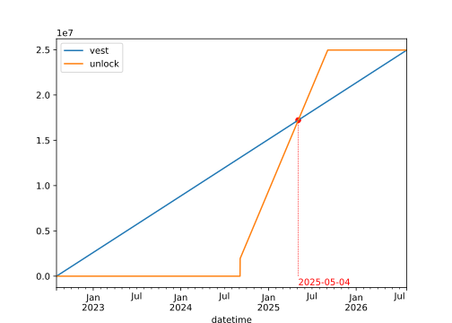

# Connext Unlock Contract

The `Unlock` contract is meant to be used as a receiver of a Yearn Vesting Escrow. It allows the owner to unlock their vested tokens at a different rate than the vesting. The main goal of that would be to delay the unlocking of the tokens in case of an early cancellation of the vesting stream.



## Dependencies

This contract is designed to be integrated with Yearn's [Vesting Escrow v0.3.0](https://github.com/yearn/yearn-vesting-escrow) contract, ([audited](https://github.com/yearn/yearn-security/tree/master/audits/20231013_Mixbytes_yearn_vesting_escrow)). The `ConnextVestingWallet` contract is meant to be the receiver of the tokens that are being vested.

**NOTE**: This Vesting Escrow contract version is compatible with post-shangai EVM versions only (as it requires `PUSH0` compatibility).

## Setup

1. Copy the `.env.example` file to `.env` and fill in the variables.
1. Install the dependencies by running `yarn install`. In case there is an error with the commands, run `foundryup` and try them again.
1. Run `yarn test` to make sure everything is working.

## Deploy & verify

```bash
# Deploys to mainnet
yarn deploy

# Deploys to Sepolia
yarn deploy:sepolia
```

## Licensing

The primary license for the contracts is MIT, see [`LICENSE`](./LICENSE).

## Contributors

Built with ❤️ by [Wonderland](https://defi.sucks), a team of top Web3 researchers, developers, and operators who believe that the future needs to be open-source, permissionless, and decentralized.

[DeFi sucks](https://defi.sucks), but Wonderland is here to make it better.
